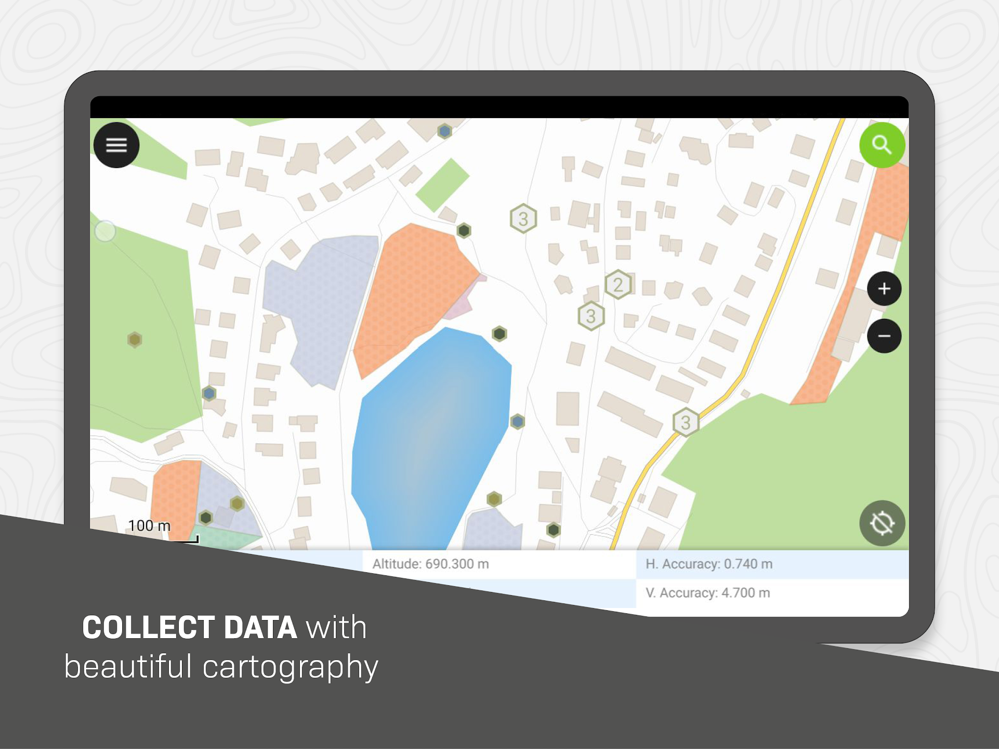

---

header:  -[Index](./index.html#1)-
footer:  Ismael Pérez GE Niphargus --  [pdf slides](./espeleo_qgis.pdf)
marp: true
title: QGIS para espeleólogos
description: Guía práctica de GIS para espelólogos
theme: uncover
paginate: true
_paginate: false

---

 
### Autores
- Óscar García
- Ismael Pérez

---

  
### GIS

- Geographic information system.
- [QGIS](https://www.qgis.org/)
  
---
  
### Recopilación de datos en exploración
- Waypoints
- Tracks -> Áreas de exploración

### Formato de datos
- Waypoints: UTM
- Tracks: GPX

---
  
### Importación de datos en QGIS
- Fuentes de mapas
  - [IGN](https://www.ign.es/web/ide-area-nodo-ide-ign)
  - QGIS plugins
    -  Complementos > Administrar e instalar complementos
- Tracks / Waypoints

---

  
### Importación de datos de cavidades
- GPX
### Exportación en KML

---

  
### Generación de webmap QGIS

- web2gis plugin
[ejemplo](../assets/files/qgis2web/index.html)

---

  
### Importación de datos del proyecto QGIS
- IGN - Mapas de España
- Google earth

---

  
### Sincronización de proyectos
- Qfield

---

  
### Opciones avanzadas
  - Planificación de prospecciones
  - Cercanía a superficie
  - Información de profundidad.
  
---

  
### Referencias
  - [Manual QGIS ESOCAN](https://www.dropbox.com/scl/fi/ppryq7sz1aeftvgheg9kv/QGIS-para-espeleo.pdf?rlkey=hqwg08i4aviaen5k359klk0gy&e=1&dl=0)
  - [QGIS for Cavers (Video)](https://www.youtube.com/watch?v=opTZnMUCNdk)
  - [QField](https://qfield.org/)
  

